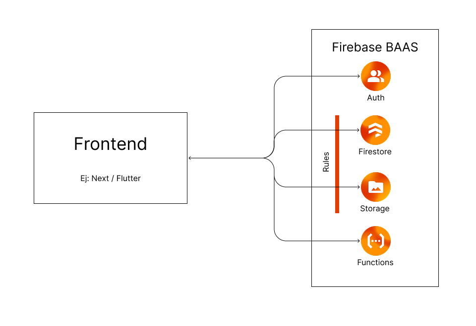

# Firebase BAAS

## 1️⃣ Firebase Auth
Authentication service that allows secure user management.
- Supports **email/password**, **external providers** (Google, Facebook, Apple, etc.) and anonymous authentication.
- Allows session management and access tokens to validate operations in other Firebase services.
- Integrates easily with Firestore and Storage to apply rules based on the authenticated user.

---

## 2️⃣ Firestore (NoSQL Database)
- Real-time and scalable database based on documents and collections.
- Allows complex queries and instant synchronization with the frontend.
- Ideal for applications with dynamic data and multiple users.
- **Security:**
  - Managed through **Firestore Security Rules**, where read and write conditions are defined.
  - Example: allow access only to documents whose `userId` matches `request.auth.uid`.

---

## 3️⃣ Firebase Storage
- Cloud storage for files such as images, documents, or videos.
- Scalable with support for large data volumes.
- **Security:**
  - Controlled through **Storage Security Rules**, which allow defining which users can upload, read, or delete files.
  - Example: only allow a user to manage files within their personal folder.

---

## 4️⃣ Firebase Functions (v2)
- Allows executing **serverless code** in response to Firebase events, HTTP requests, or automatic scheduling.
- **Functions v2** improves the previous version with:
  - **Cloud Run-based architecture**, allowing faster and more granular scaling.
  - **Multi-region support**, reducing latency.
  - **Improved concurrency**, which reduces costs by reusing instances.
  - **Microservices model:**
    - Each function can act as an **independent microservice**, handling a specific context or functionality (e.g., `sendEmail`, `generateReport`, `processPayment`).
    - Allows deploying, scaling, and versioning functions separately, reducing risks and deployment times.
    - Facilitates distributed architectures without the need for a monolithic server.

---

## 5️⃣ Firebase Security Rules
- **Firestore Rules:** define permissions at document and collection level based on authentication status and data attributes.
- **Storage Rules:** control file access based on authentication, path, or metadata.
- They are the **first layer of protection** between the client (frontend) and the database or files.
- It's recommended to combine rules with **client-side and backend validation** for enhanced security.

---

## ✅ Advantages of using Firebase BAAS
- Managed backend without the need for own infrastructure.
- Integrated authentication and security.
- Automatic scalability and usage-based costs.
- **Functions v2** allows transitioning from a monolithic backend to a microservices-based architecture, improving maintainability and response times.

---

> **Note:** Although Firebase allows direct communication from the frontend, it's recommended to use security best practices, well-defined rules, and for complex projects, an additional backend for greater control.

