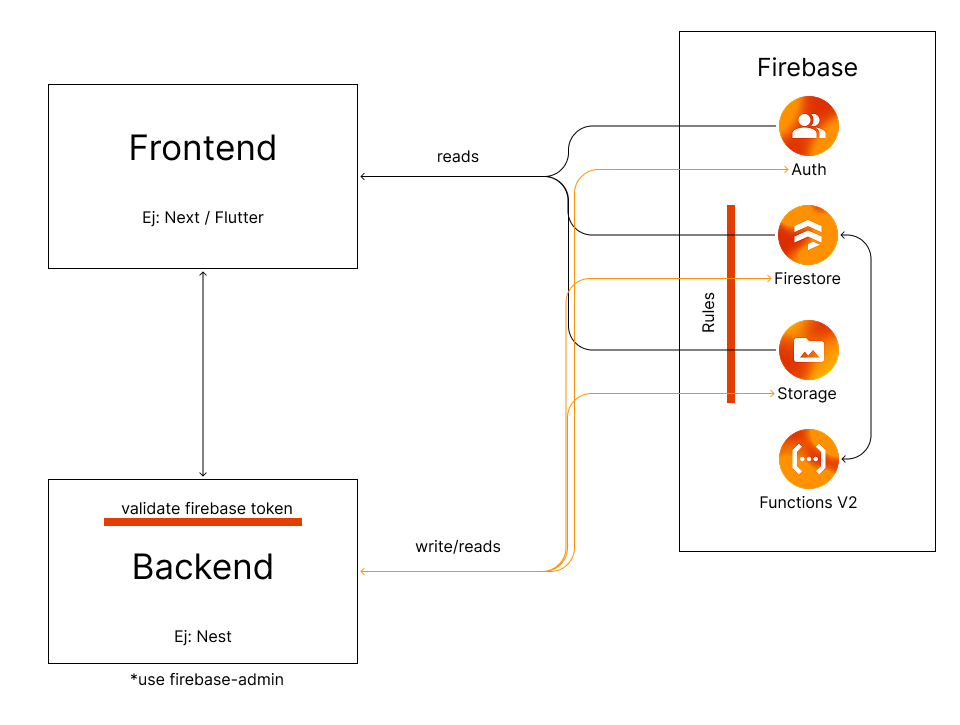

# Firebase with Backend Layer



## 🏗️ Hybrid Architecture

This architecture combines the advantages of Firebase BAAS with a **dedicated backend** that acts as an intermediate layer between the frontend and Firebase services. This approach offers greater control, security, and flexibility for complex applications.

---

## 1️⃣ Frontend (Client)
- **Technologies:** Next.js, Flutter, React, Vue, etc.
- **Responsibilities:**
  - User interface and client experience
  - **Read operations** directly to Firebase (Auth, Firestore, Storage)
  - Communication with backend for complex operations
- **Security:** All operations are subject to **Firebase Security Rules**

---

## 2️⃣ Backend (Server)
- **Technologies:** NestJS, Express, FastAPI, etc.
- **Responsibilities:**
  - **Token validation** using Firebase Admin SDK
  - **Privileged write and read operations** with elevated permissions
  - Complex business logic and data processing
  - Integration with external services (APIs, payment systems)
  - Data validation and transformation
- **Firebase Admin SDK:** Uses `firebase-admin` for administrative operations
- **Key Functions:**
  - **Validate Firebase tokens** from frontend requests
  - **Bypass Security Rules** when using service account credentials
  - **Perform administrative operations** on user accounts and data
  - **Handle complex transactions** and business workflows

---

## 3️⃣ Firebase Services

### 🔐 Firebase Auth
- **Frontend:** User authentication and session management
- **Backend:** Token verification and user management with Admin SDK
- **Security:** Authentication rules applied at both levels

### 📊 Firestore (Database)
- **Frontend:** Real-time reads and simple queries
- **Backend:** Writes, complex operations, and transactions
- **Security Rules:** Control access from both frontend and backend

### 📁 Firebase Storage
- **Frontend:** File viewing and downloading
- **Backend:** File upload, processing, and management
- **Security:** Storage rules applied according to context

### ⚡ Firebase Functions V2
- **Serverless functions** that execute in response to Firebase events
- **Internal interaction:** Can access Firestore and Storage directly without Rules
- **Event-driven architecture:** Triggers on database changes, authentication events
- **Use cases:** 
  - **Background processing:** Image resizing, data aggregation
  - **Webhooks:** Third-party service integration
  - **Data synchronization:** Cross-collection updates
  - **Automated workflows:** Business process automation

---

## 4️⃣ Rules Layer
- **Firebase Security Rules:** Primary access control for all Firebase services
- **Frontend Operations:** All direct reads must pass through Security Rules
- **Backend Operations:** Can bypass Rules when using Firebase Admin SDK with service accounts
- **Double Protection:** 
  - Rules for client-side access control
  - Backend validation for business logic and data integrity
- **Security Model:** 
  - **Client-side:** Restricted by Rules based on user authentication
  - **Server-side:** Administrative privileges with additional validation layers

---

## 🔄 Data Flow

### Frontend Direct Reads
```
Frontend → Rules → Firebase Services (Auth, Firestore, Storage)
```
- **Direct read access** to Firebase services for real-time data
- **Optimized performance** with client-side caching
- **Real-time synchronization** for live updates
- **Subject to Firebase Security Rules** for access control

### Backend Operations
```
Frontend ↔ Backend → Rules → Firebase Services
```
- **Bidirectional communication** between Frontend and Backend
- **Token validation** using Firebase Admin SDK
- **Privileged write/read operations** with elevated permissions
- **Complex business logic** and data processing
- **External service integration** (APIs, payment systems, etc.)

### Firebase Functions Internal
```
Firebase Functions V2 → Firestore/Storage
```
- **Serverless processing** in response to Firebase events
- **Direct database access** without going through Rules
- **Background tasks** and automated workflows
- **Event-driven architecture** for scalability

---

## ✅ Advantages of this Architecture

### 🔒 Enhanced Security
- **Multi-layer protection:** Firebase Rules + Backend validation + Admin SDK
- **Token validation:** Backend verifies Firebase tokens for each request
- **Administrative control:** Backend can bypass Rules when needed for legitimate operations
- **Audit trail:** Comprehensive logging of all operations across layers

### 🚀 Performance & Flexibility
- **Optimized reads:** Frontend direct access for real-time data with caching
- **Complex operations:** Backend handles heavy processing and external integrations
- **Scalable architecture:** Each layer can scale independently
- **Event-driven processing:** Functions handle background tasks automatically

### 🛠️ Development & Maintenance
- **Clear separation:** Frontend (UI), Backend (Logic), Firebase (Data)
- **Technology flexibility:** Choose best tools for each layer
- **Independent testing:** Each layer can be tested in isolation
- **Easier debugging:** Issues can be isolated to specific layers

---

## 📋 Ideal Use Cases

### ✅ Enterprise Applications
- Complex management systems
- Applications with sophisticated business logic
- Systems requiring integration with multiple services

### ✅ High-Security Applications
- Financial systems
- Healthcare applications
- Platforms with sensitive data

### ✅ Applications with External Integration
- Payment systems
- Third-party APIs
- Complex notification services

---

## ⚠️ Considerations

### 💰 Costs & Resources
- **Backend hosting:** Additional server infrastructure costs
- **Development time:** More complex architecture requires longer initial setup
- **Maintenance overhead:** Multiple systems to monitor and maintain
- **Team expertise:** Requires knowledge of both Firebase and backend technologies

### 🔧 Technical Complexity
- **Distributed architecture:** More components and potential failure points
- **Cross-layer debugging:** Issues may span multiple layers
- **Deployment complexity:** Coordinated deployments across multiple systems
- **Data consistency:** Ensuring consistency between frontend cache and backend state

---

> **Recommendation:** This hybrid architecture is ideal for applications that require greater control, security, or integration with external services. For simple applications, direct Firebase BAAS may be more efficient. Consider this approach when you need administrative operations, complex business logic, or third-party integrations that go beyond Firebase's capabilities. 